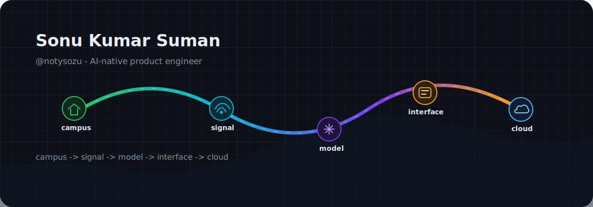
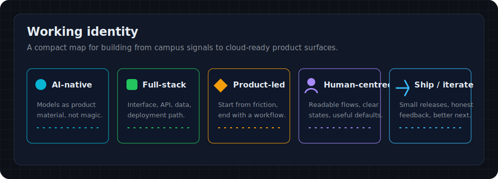
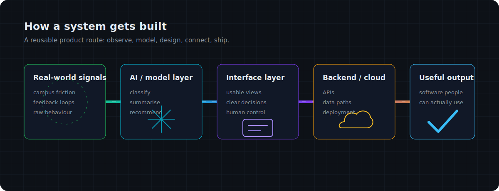
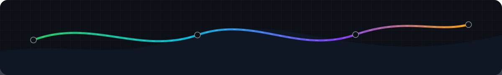

<p align="center">
  
</p>

<h1 align="center">Sonu Kumar Suman <code>@notysozu</code></h1>

<p align="center">
  <strong>AI-native product engineer from campus to cloud.</strong><br />
  I build full-stack systems that turn messy real-world signals into useful, human-centred software.
</p>

<p align="center">
  <a href="https://sonu-kumar.in">Website</a>
  | <a href="https://github.com/notysozu">GitHub</a>
  | <a href="mailto:contact@sonu-kumar.in">Email</a>
  | <a href="https://linkedin.com/in/notysozu">LinkedIn</a>
  | <a href="https://discord.gg/y4KPr7Y2y2">Discord</a>
</p>

## Builder thesis

I am a student builder at **Sapthagiri NPS University**, using campus as a live lab for product thinking. The pattern I keep returning to is simple: notice a real signal, shape it with software, test it with people, and move the useful parts closer to production.

My default map is **campus -> signal -> model -> interface -> cloud**. It keeps the work grounded: the model is not the product, the interface is not decoration, and the backend is not an afterthought.

<p align="center">
  
</p>

## Featured systems/projects

<p align="center">
  
</p>

| System | Signal it listens to | What it turns into |
| :--- | :--- | :--- |
| **smartdesk**<br /><br />AI-assisted student feedback intelligence platform for universities. | **Problem it solves:** helps turn student feedback into a clearer signal for campus teams.<br /><br />**Stack:** Semantic GenAI | **Status:** active system concept from the profile portfolio.<br /><br />**Open:** [github.com/notysozu/smartdesk](https://github.com/notysozu/smartdesk)<br />**Demo:** Add when public |
| **secure-code-env**<br /><br />OpenEnv standard AI environment for detecting and patching vulnerabilities. | **Problem it solves:** explores safer AI-assisted coding workflows for security-sensitive environments.<br /><br />**Stack:** Agentic Security | **Status:** open-source system from the profile portfolio.<br /><br />**Open:** [github.com/notysozu/secure-code-env](https://github.com/notysozu/secure-code-env)<br />**Demo:** Add when public |
| **EchoTrace**<br /><br />Audio-first platform to experience history through immersive sound. | **Problem it solves:** turns historical context into a more sensory, interface-led experience.<br /><br />**Stack:** Immersive UX | **Status:** product experiment from the profile portfolio.<br /><br />**Open:** [github.com/notysozu/EchoTrace](https://github.com/notysozu/EchoTrace)<br />**Demo:** Add when public |

**Extra systems in the queue:** why.fi, OncoVision-API, DeepGuard, and smaller experiments that test AI, interface, and backend ideas in public.

## Stack and working style

I like stacks that let ideas move quickly without hiding the craft. The goal is not to collect tools; it is to connect the right layer to the right problem.

| Layer | Current working set |
| :--- | :--- |
| **Frontend** | React, Next.js, TypeScript, JavaScript, Redux |
| **Backend** | Node.js, API design, server-side product logic |
| **Databases** | Data modelling and persistence layers as each system needs them |
| **AI / Automation** | Agentic AI, semantic GenAI, AI-assisted workflows |
| **Tools** | Git, Figma, GitHub Actions, product prototyping |
| **Product style** | Prototype close to the user, simplify the path, ship small improvements, keep the interface readable. |

## Education and current focus

| Signal | Current note |
| :--- | :--- |
| **University** | Sapthagiri NPS University |
| **Primary identity** | AI-native product engineer from campus to cloud |
| **Tagline** | Campus problems, modelled into usable software |
| **Primary identity variable** | AI-native product engineer |
| **Secondary identity** | Full-stack builder with UX taste |
| **Current focus** | Agentic AI, scalable SaaS patterns, and UI/UX optimisation |
| **Preferred motif** | Campus-to-Cloud Blueprint |

## Dynamic signal board

<p align="center">
  
  
</p>

<p align="center">
  <sub>Public language charts show repository composition, not full skill depth.</sub>
</p>

## Contribution narrative

The contribution graph is a build diary: experiments, fixes, refactors, notes, and small shipped surfaces. I care less about streak theatre and more about leaving a trace of steady learning.

<p align="center">
  
</p>

## Build philosophy snippet

```txt
campus signal enters
  -> model finds structure
  -> interface earns trust
  -> backend carries the weight
  -> cloud makes it reachable

Useful software is the part that survives contact with people.
```

## Contact / collaboration CTA

I am open to thoughtful collaborations around AI-native tools, student workflows, applied automation, full-stack product prototypes, and clean interface systems.

**CTA:** Bring a real problem, a rough signal, or an early product idea. I can help shape it into a system people can use.

Best route: [sonu-kumar.in](https://sonu-kumar.in) | [contact@sonu-kumar.in](mailto:contact@sonu-kumar.in) | [LinkedIn](https://linkedin.com/in/notysozu)

## Fun facts

| Small signal | Note |
| :--- | :--- |
| **One** | I like systems that begin with a messy human workflow and end as a clean product surface. |
| **Two** | My favourite build loop is prototype, test, simplify, then ship the smaller sharper version. |
| **Three** | I treat campus as a useful pressure test for software: real constraints, real users, real feedback. |

## Footer visual

<p align="center">
  
</p>
